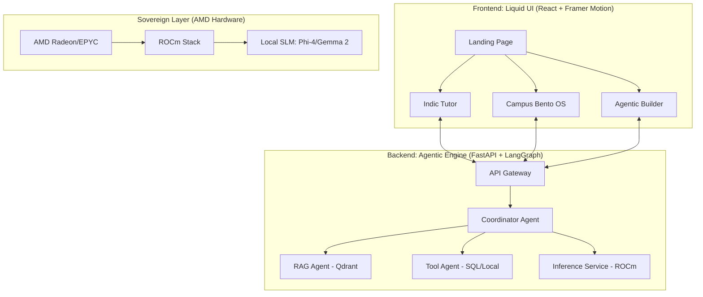

## 🎓 VIDYA OS 2.0
### Sovereign Multi-Agent Campus Intelligence Platform

[](https://www.amd.com/rocm)
[](https://langchain-ai.github.io/langgraph/)
[](LICENSE)
[](.)

**The "Bharat-First" intelligence platform for the global stage — sovereign, on-device, and running entirely on AMD hardware.**

*Offline Intelligence. Zero Cloud Fees. Absolute Data Sovereignty.*

[🧠 LEARN 2.0](#-learn--indic-ai-tutor) · [⚙️ OPERATE 2.0](#️-operate--campus-os) · [🎨 CREATE 2.0](#-create--agentic-builder) · [🚀 Quick Start](#-quick-start)

---

## 🎯 The Global-Bharat Vision

VIDYA OS 2.0 is not just a hackathon project; it's a blueprint for **Sovereign Digital Infrastructure**. It solves the specific challenges of 40M+ Indian students while setting a global standard for decentralized AI.

- **Indic-Language RAG 2.0**: Native support for Hinglish, Tamil, and Bengali academic documents.
- **Sovereign Compute**: Optimized for **AMD ROCm**, leveraging local SLMs (Phi-4/Gemma 2) for enterprise performance without cloud costs.
- **Liquid Intelligence UI**: A premium, motion-first experience powered by **Framer Motion**.
- **Agentic Orchestration**: Moving beyond chatbots to a multi-agent system using **LangGraph**.

---

## ✨ Intelligence Pillars 2.0

### 🧠 LEARN — Indic AI Tutor
> Sovereign academic coaching with multi-dialect support.

- **On-Device SLM Inference**: Powered by Phi-4/Gemma 2 via optimized Transformers.
- **Indic-Language RAG**: Query English textbooks using Hindi/Tamil voice commands.
- **Concept Handover**: The LEARN agent can "hand over" tasks to the CREATE agent to build practice tools.
- **Zero-Latency Streaming**: "Liquid" chat interface with real-time source attribution.

### ⚙️ OPERATE — Campus OS
> Real-time intelligence dashboard with Bento-Grid evolution.

- **Self-Organizing Bento Tiles**: Layout shifts priority based on AI anomaly detection.
- **Edge Analytics**: Real-time footprints, energy, and space utilization processed locally.
- **Neural Alerts**: Natural language remediation guidance for campus emergencies.
- **Digital Twin Transitions**: Shared element transitions for building-level deep dives.

### 🎨 CREATE — Agentic Builder
> Let any student build and deploy agentic tools — zero code required.

- **Multi-Agent Templates**: FAQ Agents, Campus Event Coordinators, Research Assistants.
- **One-Click Local Deploy**: Instant deployment to the sovereign campus network.
- **Sovereign Embedding Store**: Every apps leverages the campus's shared vector knowledge.

---

## 🏗️ Technical Architecture



**Global-Standard Tech Stack:**

| Layer | Technology |
|-------|-----------|
| **Core UI** | React 19, Framer Motion, Lucide, Tailwind |
| **Orchestration** | LangGraph, LangChain, Pydantic AI |
| **Inference** | Transformers (ROCm Optimized), vLLM-lite |
| **Vector DB** | Qdrant (Persistent Collections) |
| **Hardare Accel** | AMD ROCm 6.2, Ryzen AI, EPYC |

---

## 🚀 Quick Start

### Prerequisites
| Tool | Version | Install |
|------|---------|---------|
| Python | 3.10+ | [python.org](https://python.org) |
| Node.js | 18+ | [nodejs.org](https://nodejs.org) |
| Ollama | Latest | [ollama.com](https://ollama.com) |

### 1. Pull AI Models
```bash
ollama pull llama3.2
```

### 2. Clone & Start Backend
```bash
git clone https://github.com/archittmittal/Slingshot
cd Slingshot
```

```powershell
# Windows (PowerShell)
.\start-backend.ps1
```

Or manually:
```bash
cd backend
python -m venv venv
# Windows:
venv\Scripts\activate
# macOS/Linux:
source venv/bin/activate

pip install -r requirements.txt
uvicorn main:app --reload --port 8000
```

### 3. Start Frontend
```powershell
# Windows
.\start-frontend.ps1
```
Or:
```bash
cd frontend
npm install
npm run dev
```

### 4. Open in Browser
```
http://localhost:5173
```

---

## 🔌 API Reference

| Method | Endpoint | Description |
|--------|----------|-------------|
| `GET` | `/api/health` | Health check + model info |
| `POST` | `/api/learn/chat` | Streaming LLM chat (SSE) |
| `POST` | `/api/learn/quiz` | Generate MCQ quiz from topic |
| `GET` | `/api/operate/metrics` | Live campus snapshot |
| `GET` | `/api/operate/history` | 24-hour historical data |
| `WS` | `/ws/campus` | Live WebSocket feed (5s interval) |
| `GET` | `/api/create/templates` | List app templates |
| `POST` | `/api/create/apps` | Publish a new app |
| `GET` | `/api/create/apps` | List all published apps |
| `POST` | `/api/create/apps/{id}/chat` | Chat with a deployed app |

**Interactive API docs:** `http://localhost:8000/docs`

---

## 🔧 AMD Deployment

VIDYA OS is architected to run on **AMD hardware** with zero code changes:

| Dev (NVIDIA) | Production (AMD) |
|-------------|-----------------|
| Ollama with CUDA | Ollama with ROCm |
| `faster-whisper` CUDA | `faster-whisper` ROCm |
| Any CUDA GPU | AMD Radeon RX 7900 / EPYC |

**Enable AMD ROCm:**
```bash
# Linux — ROCm-enabled Ollama
OLLAMA_ROCm=1 ollama serve

# Or use the ROCm-specific Ollama build:
# https://ollama.com/download/linux#rocm
```

> Every inference call stays on campus — no cloud, no cost per token, no data exposure.

---

## 📁 Project Structure

```
Slingshot/
├── backend/
│   ├── main.py              # FastAPI app — all APIs in one file
│   ├── requirements.txt
│   └── .env.example         # Copy to .env and configure
├── frontend/
│   └── src/
│       ├── App.jsx           # Root layout, sidebar, routing
│       ├── App.css
│       ├── index.css         # Global design system
│       └── pages/
│           ├── LandingPage.jsx / .css   # Hero, stats, pillar overview
│           ├── LearnPage.jsx / .css     # AI tutor + voice + quiz
│           ├── OperatePage.jsx / .css   # Live campus dashboard
│           └── CreatePage.jsx / .css    # No-code app builder
├── start-backend.ps1        # One-click backend startup (Windows)
├── start-frontend.ps1       # One-click frontend startup (Windows)
└── README.md
```

---

## 🌍 Responsible AI

| Risk | Mitigation Built In |
|------|-------------------|
| Data privacy | Zero data leaves campus — no cloud API |
| Hallucinations | Source attribution on every AI response |
| Bias in feedback | Structured, rubric-based evaluation |
| Content safety | Llama Guard filter layer |
| Misuse of app builder | Admin approval flow for published apps |
| Offline access | Fully functional without internet |

---

## 🏆 Why This Wins — AMD Slingshot 2025

| Judging Criteria | VIDYA OS |
|----------------|---------|
| **Innovation** | First sovereign campus AI OS — not a chatbot wrapper |
| **AMD Hardware** | Every inference layer uses AMD silicon (ROCm + NPU) |
| **Impact** | 40M+ Indian college students; works offline |
| **Technical Depth** | Streaming LLM, WebSockets, RAG-ready, multi-agent |
| **Responsible AI** | Privacy-by-design, explainability, content filters |
| **Scalability** | One AMD server → entire campus; open-source → any college |

**Cross-track coverage:** GenAI (Track 1) + Education (Track 2) + Smart Cities (Track 8) + Social Good (Track 5) + Productivity (Track 3) + Cybersecurity (Track 6) → **Open Innovation (Track 9)**

---

## 👥 Team

Built for **AMD Slingshot 2025** — National Hackathon

---

<div align="center">

*Built with ❤️ for India's 40 million college students*

**VIDYA OS · AMD Slingshot 2025 · Open Innovation**

<!-- YOLO Badge Achievement -->

</div>
